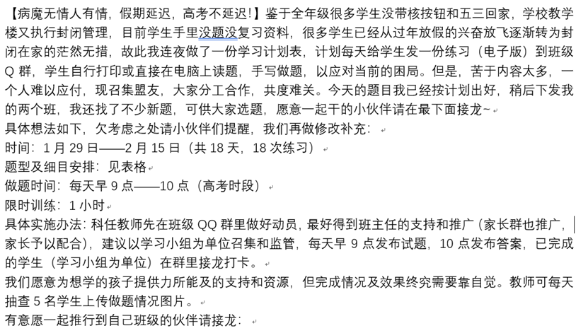

# 疫中编·贰

## 网课

当初，毕业班的学子率先体会到了疫情的一个小侧面，相信也是毕业班的学子和老师对此体会最为深刻，毕竟虽不能说算是“后无来者”，但一定是前无古人的操作，这便是2020年最常被做学生的孩子们挂在口中的网课——学名或许叫做在线课程(Online Course)。

这里不免还要提起很多人在孩童时期曾经在那些描绘2020年的作文里写道：“小孩子们不需要去学校，只需要在家里就能上课……”嚯，他们预言得可真准！只是他们根本想不到是在这样的环境中，以这样的方式尽管网课本不是什么新鲜事，猿辅导、学而思、还有各种学习机构都在做。但让常年在校的一线教师直接接触网课，适应网络教学的方式，或许这还是第一次。

1月29号中午，以聂姐姐为代表的高三语文组举着“降魔十八练”的大旗，打响了南三线上教学的第一枪。现在想来，聂姐还是一个很勇于创新，很有担当，很接地气的老师。

——以下引用聂姐的文档原话，以求还原情境的真实性。

> “降魔十八练”只是一个规划和开始，从单纯的练习到局部科目的线上直播课，再到整个年级对所有课程进行大致的统筹安排。尽管说整个网课期间确实存在一些“强制”“令人反感”的命令式的要求，但总的来说，老师和同学们都是在共同想办法渡过难关的。

有的站在时代最前沿的老师，比如众所周知的南三车神封封（L-Ser），很快就上手了这种讲课模式，并且从始至终都在B站开房间讲解，讲课效率和效果都与学校无差。但是刚开始的时候，确也有部分本来在学校讲课效果极好的老师，在直播模式下的讲课效果并不好（照顾到他老人家的面子，就不说名字了）。至于后来如何，他作为一位如此受同学们喜欢的老师，我需要怀疑他的能力吗？

我印象中的网课并没有太多放送事故，倒是在腾讯会议的那些课程中出现了由于意外开麦而本人未知造成的场面，至于有哪些经典场面，摘取下面的语音片段便能窥知一二：

> “敌军还有5秒到达战场，请做好准备——”
>
> “（脏话）”
>
> “妈这边要上课了你等下先！&￥#@*%！……”
>
> “你们可能不知道，只用20万赢到578万，是什么概念。……”

现在回想起来，或许其中有些还是故意来活跃气氛的，这些大约是能让人提起精神上课的乐子。不过和校内的课堂一样，最重要的还是那些讲课的老师，他们是主播，也是网课中绝对的主角。

聂姐还是那个我们印象中熟知的甩手掌柜，有时候我们看到的是市里边组织录制的空中课堂，有时候则是她前一天晚上提前录好的课程（或许是白天要带聪聪的原因吧，之前的文章提过，她同时也是一位很尽职的母亲）。当然，甩手不代表她不管我们，作业方面聂姐还是管得很勤快的，在作文练习期间尤为突出——每一次都能听到聂姐的语音点评，就像在教室外的走廊一般亲切和蔼，该赞赏的赞赏，该数落的也要用她最喜欢的反问句数落一通。

罗姐，将线上教学变回传统讲课的代表者。她从不用任何PPT，而是将练习悉数发下，然后摄像头对准一面大白板——该调侃的人还得调侃，该玩梗的还得玩梗。不过在她开B站直播的第一天，很多人都被她的语气吓到了，或许这就是仅属于罗姐的魅力吧。至于家里面的两位小姑娘偶尔会出来闹一闹，这我们倒是见怪不怪，因为罗姐家的小姑娘经常会出现在校内的课堂，深得大家的喜爱。小姑娘们出现在镜头里的时候，我们偶尔会要求小朋友发表一下“讲话”，罗姐总是这样说：“跟哥哥姐姐们打个招呼吧！”

或许是声音和节奏恰好合适的缘故，小雪的物理课总是让人觉得很舒服。但是这里要说的是小雪家的两只鹦鹉，如果小雪是在客厅开摄像头直播，那么背景音必定是鹦鹉在叫了。好在那时候小猫小歪还没有来，据小雪说只要她坐在电脑前面，小歪就会跳到键盘上。

如果要回忆起网课效率最高的时候，我相信应该是只上半天课，下午消化吸收，晚上进行各学科测试的日子，当然隔几天有强化训练也是应该的。起码整体的节奏还是很能让人适应。但后来年级就抓得太紧了，特别是某些本不必要的打卡签到。有的家庭父母都很辛苦，还要在很准点的时刻准备饭菜，这其实是很不公平的。尽管我们都能明白，老师们费了很多苦心，希望大家都好好学，不要因为线下变成了线上而荒废，但是网课始终和线下有所区别，如果不营造一种氛围轻松，内容上充实的环境，那反而会适得其反。

今天（2021年1月29日）恰好是2020届高三网课开始一周年的日子，不管怎么说，一切真的都已经过去了，那些文档依旧静静躺在磁盘里，没有人来删除它们，却也不会有人再需要认认真真地做它们了。那些网课视频依旧在录播UP的合辑中保存完好，若是有人去回顾，也仅仅是为了了却一番回忆，那并非网课本身的目的。但是那番经历是我们真实经历过的，老师和同学们共同度过的网课时光已经烙印在我们的回忆当中。

聂姐在计划表中写得虽相当朴素，在当时看来却是老师们无比真实的感想：“等到春暖花开时，相信孩子们会交出一份令人满意的答卷，‘停课不停学，老师成主播’也注定是我们教学生涯中最难忘的回忆。”

<!-- 停课不停学：原文为“听课不停学”，为输入法错误导致，此处补正。 -->

而要我说，于我们而言，不过是向未来摆渡的途中，暂且换了一艘新颖的船，船上的人还是那些人，却有了不同于原本应有的回忆。

覃雪祈

2021雪祈季 冰月十七

彼岸纪日 Day-3 阳日5时08分

